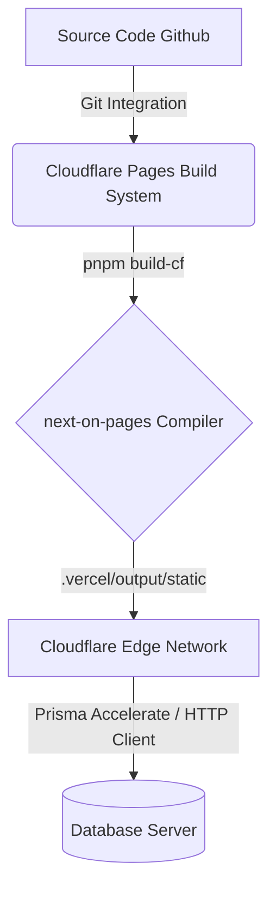

# Hướng Dẫn Chi Tiết Triển Khai Dự Án Taxonomy Lên Cloudflare Pages

Tài liệu này hướng dẫn chi tiết từng bước cấu hình, tối ưu hóa và triển khai dự án **Next.js 13 (Taxonomy)** sử dụng **Prisma**, **Contentlayer** và **NextAuth** lên **Cloudflare Pages** thông qua Edge Runtime.

---

## 📌 Tổng Quan Kiến Trúc

Cloudflare Pages chạy trên môi trường **Edge Runtime (V8 isolates)** chứ không phải môi trường Node.js truyền thống. Do đó, để chạy dự án Next.js mượt mà, chúng ta cần:
1. Chuyển đổi ứng dụng Next.js sang định dạng tương thích với Cloudflare Pages thông qua công cụ `@cloudflare/next-on-pages` (hoặc `@opennextjs/cloudflare`).
2. Sử dụng giải pháp kết nối Cơ sở dữ liệu (Database) tương thích với Edge vì các kết nối TCP trực tiếp của Prisma thông thường không hoạt động được trên Edge.
3. Bật cờ tương thích Node.js (`nodejs_compat`) trên Cloudflare.



---

## 🛠️ Bước 1: Cấu Hình Mã Nguồn Dự Án

### 1.1 Cài đặt các gói phụ thuộc (Dependencies)

Đảm bảo dự án đã được cài đặt công cụ biên dịch của Cloudflare. Chạy lệnh sau trong thư mục gốc của dự án:

```bash
pnpm add -D @cloudflare/next-on-pages wrangler
```

Nếu sử dụng **Prisma** làm ORM, bạn cần cài đặt thêm Client mới nhất hỗ trợ môi trường Edge. Chọn một trong hai phương án kết nối dưới đây:

#### 🔹 Phương án A: Kết nối trực tiếp qua PlanetScale (Không cần Proxy)
PlanetScale hỗ trợ kết nối qua HTTP driver, rất thích hợp cho môi trường Edge:
```bash
pnpm add @prisma/adapter-planetscale @planetscale/database
pnpm add -D prisma@latest
pnpm add @prisma/client@latest
```

#### 🔹 Phương án B: Sử dụng Prisma Accelerate (Khuyên dùng cho MySQL/PostgreSQL thông thường)
Prisma Accelerate cung cấp một connection string dạng `prisma://` làm proxy trung gian để tối ưu truy vấn trên Edge:
```bash
pnpm add @prisma/extension-accelerate
```

---

### 1.2 Cấu hình build script trong [package.json](package.json)

Mở file [package.json](package.json) và thêm lệnh `build-cf` để biên dịch ứng dụng bằng `@cloudflare/next-on-pages`:

```json
"scripts": {
  "dev": "concurrently \"contentlayer dev\" \"next dev\"",
  "build": "contentlayer build && next build",
  "build-cf": "contentlayer build && npx @cloudflare/next-on-pages",
  "start": "next start",
  "lint": "next lint"
}
```

> [!NOTE]
> Lệnh `contentlayer build` cần chạy trước để biên dịch các file MDX/Content thành các file tĩnh JSON trước khi Cloudflare Pages đóng gói.

---

### 1.3 Cập nhật file kết nối cơ sở dữ liệu [lib/db.ts](lib/db.ts)

Vì Prisma Client thông thường không thể chạy trực tiếp trên Cloudflare Pages Edge, hãy cập nhật file [lib/db.ts](lib/db.ts) tùy thuộc vào phương án cơ sở dữ liệu bạn đã chọn ở trên:

#### 💻 Lựa chọn 1: Sử dụng Prisma Accelerate (Khuyên dùng)
Thay thế nội dung file [lib/db.ts](lib/db.ts) bằng code sau:

```typescript
import { PrismaClient } from "@prisma/client"
import { withAccelerate } from "@prisma/extension-accelerate"

declare global {
  var cachedPrisma: ReturnType<typeof getExtendedClient>
}

const getExtendedClient = () => {
  return new PrismaClient().$extends(withAccelerate())
}

let prisma: ReturnType<typeof getExtendedClient>

if (process.env.NODE_ENV === "production") {
  prisma = getExtendedClient()
} else {
  if (!global.cachedPrisma) {
    global.cachedPrisma = getExtendedClient()
  }
  prisma = global.cachedPrisma
}

export const db = prisma
```

#### 💻 Lựa chọn 2: Sử dụng PlanetScale Driver Adapter
Nếu bạn sử dụng PlanetScale làm cơ sở dữ liệu chính:

```typescript
import { PrismaClient } from "@prisma/client"
import { PrismaPlanetScale } from "@prisma/adapter-planetscale"
import { Client } from "@planetscale/database"

declare global {
  var cachedPrisma: PrismaClient
}

let prisma: PrismaClient

if (process.env.NODE_ENV === "production") {
  const client = new Client({ url: process.env.DATABASE_URL })
  const adapter = new PrismaPlanetScale(client)
  prisma = new PrismaClient({ adapter })
} else {
  if (!global.cachedPrisma) {
    const client = new Client({ url: process.env.DATABASE_URL })
    const adapter = new PrismaPlanetScale(client)
    global.cachedPrisma = new PrismaClient({ adapter })
  }
  prisma = global.cachedPrisma
}

export const db = prisma
```

---

### 1.4 Khai báo Edge Runtime cho API Routes & Pages

Cloudflare Pages yêu cầu cấu hình Edge Runtime cho tất cả các file xử lý API (API Routes) hoặc các trang có tương tác động trực tiếp với Database/Auth.

Thêm dòng sau vào đầu tất cả các file route cần thiết (ví dụ: `app/api/posts/route.ts`, `app/api/users/route.ts`, v.v.):

```typescript
export const runtime = "edge"
```

> [!IMPORTANT]
> Cần đảm bảo file cấu hình Route Authentication chính của bạn (ví dụ `app/api/auth/[...nextauth]/route.ts`) cũng có khai báo `export const runtime = "edge"`.

---

### 1.5 Cấu hình file [wrangler.json](wrangler.json) (Dành cho việc quản lý cấu hình bằng code hoặc CLI)

Thay vì cấu hình thủ công hoàn toàn trên Dashboard, bạn có thể tạo hoặc cập nhật file [wrangler.json](wrangler.json) tại thư mục gốc của dự án để khai báo thư mục build và các cờ tương thích:

```json
{
  "name": "shadcn-ui-taxonomy",
  "compatibility_date": "2024-04-03",
  "compatibility_flags": [
    "nodejs_compat"
  ],
  "pages_build_output_dir": ".vercel/output/static"
}
```

*   **`pages_build_output_dir`**: Định nghĩa thư mục chứa output sau khi chạy lệnh build (`.vercel/output/static`).
*   **`compatibility_flags`**: Cấu hình `nodejs_compat` ngay trong code để bật khả năng tương thích Node.js trên Cloudflare Pages mà không cần vào Dashboard chỉnh tay.

---

## 🌐 Bước 2: Cấu Hình Trên Cloudflare Dashboard

Sau khi cấu hình mã nguồn thành công, hãy thực hiện đẩy (push) code mới lên repository của bạn (GitHub/GitLab). Tiến hành các bước triển khai trực quan trên Cloudflare Dashboard như sau:

### 2.1 Tạo dự án Cloudflare Pages mới
1. Truy cập [Cloudflare Dashboard](https://dash.cloudflare.com/) và đăng nhập.
2. Từ thanh menu bên trái, chọn **Workers & Pages** > nhấn nút **Create Application** > chọn tab **Pages**.
3. Nhấp vào **Connect to Git** và liên kết tài khoản GitHub/GitLab của bạn.
4. Chọn đúng kho lưu trữ (repository) chứa mã nguồn dự án `shadcn-ui-taxonomy`.

### 2.2 Thiết lập Cấu hình Build (Build Settings)
Tại trang thiết lập dự án, hãy điền chính xác các thông số sau:

| Thuộc tính | Giá trị cấu hình | Giải thích |
| :--- | :--- | :--- |
| **Framework preset** | `None` | Không chọn Next.js mặc định vì chúng ta sử dụng bản build tùy chỉnh cho Edge |
| **Build command** | `pnpm build-cf` | Lệnh này sẽ chạy contentlayer và build code Next.js ra định dạng Cloudflare Pages |
| **Build output directory**| `.vercel/output/static` | Đây là thư mục chứa sản phẩm tĩnh và các Edge functions được tạo bởi adapter |

> [!TIP]
> Nếu dự án sử dụng `pnpm`, Cloudflare Pages sẽ tự động nhận diện và sử dụng `pnpm` làm trình quản lý gói.

### 2.3 Bật tính năng Node.js Compatibility (Bắt buộc)
Các thư viện như Prisma, NextAuth cần một số API cốt lõi của Node.js để chạy (như `Buffer`, `crypto`, `util`...). Do đó, bạn bắt buộc phải bật cờ tương thích này:

1. Chờ Cloudflare Pages khởi tạo dự án xong (lần build đầu tiên có thể lỗi do chưa cấu hình môi trường, đây là hiện tượng bình thường).
2. Đi tới dự án của bạn trên Cloudflare Pages > Chọn tab **Settings** > **Functions**.
3. Cuộn xuống phần **Compatibility flags**.
4. Ở cả hai mục **Production compatibility flags** và **Preview compatibility flags**, thêm cờ sau:
   - Cờ tương thích: **`nodejs_compat`**
5. Nhấp **Save** để lưu cài đặt.

---

## 🔑 Bước 3: Cấu Hình Biến Môi Trường (Environment Variables)

Next.js Taxonomy sử dụng các API bên thứ ba cũng như bảo mật phiên đăng nhập qua các biến môi trường. Đi tới **Settings** > **Environment variables** của dự án Pages và thêm đầy đủ các biến sau:

### 3.1 Các biến cấu hình chung
* `NODE_ENV`: `production`
* `NEXTAUTH_SECRET`: Một chuỗi ngẫu nhiên có độ bảo mật cao (bạn có thể tạo bằng lệnh `openssl rand -base64 32`).
* `NEXTAUTH_URL`: Địa chỉ tên miền dự án của bạn (ví dụ: `https://taxonomy-project.pages.dev`).
* `NEXT_PUBLIC_APP_URL`: Địa chỉ tương tự như `NEXTAUTH_URL` (ví dụ: `https://taxonomy-project.pages.dev`).

### 3.2 Biến môi trường cơ sở dữ liệu (Database)
* `DATABASE_URL`: 
  * Nếu dùng **Prisma Accelerate**: Điền chuỗi kết nối dạng `prisma://accelerate.prisma-data.net/?api_key=...` lấy từ Prisma Console.
  * Nếu dùng **PlanetScale**: Điền chuỗi kết nối MySQL do PlanetScale cung cấp.

### 3.3 Các biến môi trường tùy chọn khác (Auth & Services)
* `GITHUB_CLIENT_ID` và `GITHUB_CLIENT_SECRET` (Dành cho đăng nhập bằng Github).
* `POSTMARK_API_TOKEN` và `SENDGRID_API_KEY` (Dành cho việc gửi email).
* `STRIPE_API_KEY` và `STRIPE_WEBHOOK_SECRET` (Dành cho tính năng thanh toán gói dịch vụ).

---

## 🛠️ Bước 4: Khắc Phục Các Sự Cố Thường Gặp (Troubleshooting)

Khi đưa dự án Next.js 13 phức tạp lên Cloudflare Pages, bạn có thể gặp một số lỗi phổ biến dưới đây:

### ❌ Lỗi: `PrismaClientInitializationError: Prisma Client could not locate the Query Engine`
* **Nguyên nhân**: Prisma Client mặc định cố gắng tải query engine binary (tập tin thực thi) vốn chỉ chạy trên Node.js server truyền thống, không tương thích với môi trường Edge của Cloudflare.
* **Cách khắc phục**:
  1. Đảm bảo bạn đã cấu hình [lib/db.ts](lib/db.ts) để sử dụng Prisma Accelerate (`$extends(withAccelerate())`) hoặc PlanetScale Client Adapter.
  2. Đảm bảo file `schema.prisma` có thiết lập generator client đúng:
     ```prisma
     generator client {
       provider = "prisma-client-js"
     }
     ```
  3. Đảm bảo chạy lệnh `prisma generate` trước khi build (Cloudflare Pages mặc định chạy lệnh `postinstall: prisma generate` từ `package.json`).

### ❌ Lỗi: `The edge runtime does not support Node.js built-in module: xxx`
* **Nguyên nhân**: Thiếu cấu hình tương thích ngược cho Node.js API trên Cloudflare Pages.
* **Cách khắc phục**: Kiểm tra lại xem bạn đã thực hiện cấu hình cờ tương thích **`nodejs_compat`** ở cả phần **Production** và **Preview** trong tab **Settings > Functions > Compatibility flags** chưa.

### ❌ Lỗi: Build thất bại do Contentlayer không tìm thấy tệp MDX
* **Nguyên nhân**: Cloudflare Pages thực hiện build nhưng thiếu tài nguyên hoặc đường dẫn tương đối sai lệch.
* **Cách khắc phục**: Hãy chắc chắn lệnh build của bạn là `pnpm build-cf`, lệnh này chạy `contentlayer build` trước để tạo thư mục `.contentlayer/` chứa toàn bộ metadata và nội dung MDX đã biên dịch tĩnh trước khi `@cloudflare/next-on-pages` quét và nạp tài nguyên tĩnh.

---

## 🚀 Bước 5: Triển Khai Lại và Kiểm Tra

### Cách 1: Triển khai qua Git Integration (Khuyên dùng)
1. Sau khi cập nhật cấu hình và biến môi trường đầy đủ, hãy chuyển sang tab **Deployments** trên Cloudflare Pages.
2. Chọn bản build gần nhất và nhấn **Retry deployment** hoặc thực hiện một commit mới và push lên repo.
3. Khi quá trình build kết thúc thành công, bạn sẽ nhận được đường dẫn có dạng `https://<ten-du-an>.pages.dev` để truy cập trực tiếp trang web của mình.

### Cách 2: Triển khai trực tiếp từ CLI bằng Wrangler
Nếu bạn muốn tự build và triển khai trực tiếp từ môi trường cục bộ (hoặc từ CI/CD của riêng mình):
1. Chạy lệnh build cục bộ:
   ```bash
   pnpm build-cf
   ```
2. Thực hiện triển khai thư mục đã build lên Cloudflare Pages sử dụng cấu hình từ file [wrangler.json](wrangler.json):
   ```bash
   npx wrangler pages deploy
   ```

> [!TIP]
> Bạn có thể liên kết tên miền riêng (Custom Domain) hoàn toàn miễn phí tại tab **Custom domains** của dự án Cloudflare Pages để sử dụng tên miền cá nhân thay vì đuôi mặc định `.pages.dev`.
